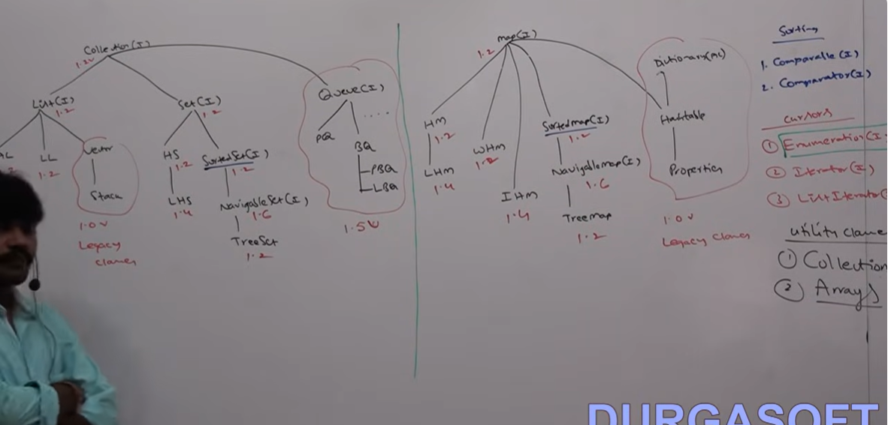

# Array:
- An array is an indexed collection of fixed number of homogenous data elements.
- The main advantage of array is, we can represent multiple values by using single variable so that readability of the code will be improved.

# Limitations of Array:
- Arrays are fixed in size. once we creates an array there is no chance of increasing or decreasing the size based on our requirement.
- Due to this to use arrays concept we must know the size in advance which may not possible always.\
- Array can hold only homogeneous data type elements.
e.g.
Student[] s = new Student[1000];
s[0] = new Student();
s[1] = new Customer();
    CE: incompatible types
        found: Customer
        required: Student

- We can solve this problem by using Object type arrays.
Object[] a = new Object[1000];
a[0] = new Student();
a[1] = new Customer();

- Arrays concept not implemented based on some standard data structure and hence ready-made method support is not available
- For every requirement we have to write the code explicitly which increases complexity of programming.

- To overcome above problems of arrays we should go for collection concept.

# Collections:
- Collections are growable in nature. based on our requirement we can increase or decrease the size.
- Collections can hold homogeneous and heterogeneous objects 
- Every collection class is implemented based on some standard data structure hence for every requirement ready-made data support is available
- Being a programmer we are responsible to use those methods, and we are not responsible to implement those.

# Array                                                                     Collection
------------------------------------------------------------------------------------------------------------------------------------
1. Arrays are fixed in size                                                 Collections are growable in nature. based on our requirement we can increase or decrease the size    
2. W.r.t memory, arrays are not recommended to use                          w.r.t memory, collections are recommended to use
3. w.r.t performance arrays are recommended to use                          w.r.t performance, collections are not recommended to use
4. Arrays can hold only homogeneous data type element                       Collections can hold both homogeneous and heterogeneous data type element
5. There is no underlying data structure for arrays and hence               Every collection class is implemented based on some standard data structure and hence for every requirement ready-made data support is available.
ready-made data support is not available. For every requirement
we have to write the code explicitly which increases 
complexity of programming.
6. Arrays can hold both primitive and objects                               Collections can hold only object type but not primitive

# Collection:
- If we want to represent a group of individual object as a single entity then we should go for collection.

# collection framework:
- It contains several classes and interfaces which can be used to represent a group of individual objects as a single entity.

# 9 key interfaces of collection framework:
1. Collection
2. List
3. Set
4. SortedSet
5. NavigableSet
6. Queue
7. Map
8. SortedMap
9. NavigableMap

# Collection (I):
- If we want to represent a group of individual objects as a single entity then we should go for collection.
- Collection interface defines the most common methods which are applicable for any collection object 
- In general collection interface is considered as root interface of collection framework
- There is no concrete class which implements collection interface directly

# Collection vs Collections:
- Collection is an interface. If we want to represent a group of individual objects as a single entity then we should go for Collection.
- Collections is a utility class present in java.util package to define several utility methods for collection objects (like sorting, searching, etc.)

# List (I):
- It is the child interface of Collection.
- If we want to represent a group of individual objects as a single entity where duplicates are allowed where insertion order must be preserved then we should go for List.

Collection (I) 1.2v  ----> List (I) 1.2v ----> 1. ArrayList 1.2v
                                               2. LinkedList 1.2v
                                               3. Vector 1.0v ---> Stack 1.0v

# Note: In 1.2v Vector and Stack classes are re-engineered to implement List interface                         

# Set (I):
- It is the child interface of Collection
- If we want to represent a group of individual objects as a single entity where duplicates are not allowed and insertion order is not required then we should go for Set interface.

Collection (I) 1.2v ----> Set (I) 1.2v -----> HashSet 1.2v ----> LinkedHashSet 1.4v

# SortedSet (I):
- It is the child interface of Set 
- If we want to represent a group of individual objects as a single entity where duplicates are not allowed and objects should be inserted according to some sorting order then we should go for SortedSet

# NavigableSet(I):
- It is the child interface of SortedSet
- It contains several methods for navigation purposes

Collection(I) 1.2v ----> Set (I) 1.2v ----> SortedSet(I) 1.2v ----> NavigableSet(I) 1.6v ----> TreeSet 1.2v

# List                                 Set:
- Duplicates are allowed               Duplicates are not allowed
- Insertion order preserved            Insertion order not preserved

# Queue (I):
- It is the child interface of Collection
- If we want to represent a group of individual objects prior to processing then we should go for Queue.
- Usually Queue follows first in first out order but based on our requirement we can implement our own priority order also
e.g.
- before sending a mail all mailIds we have to store in some data structure in which order we added mainIDs in the same order only mail should be delivered
- for this requirement Queue is the best choice

Collect(I) --->  Queue(I) 1.5v ----> 1. BlockingQueue ---->  1. PriorityBlockingQueue
                                     2. PriorityQueue        2. LinkedBlockingQueue

# Note: All the above interfaces (Collection, List, Set, SortedSet, NavigableSet, Queue) meant for representing a group of individual objects. If we want to represent a group of objects as key-value pair then we should go for map.

# map (I):
- map is not child interface of Collection
- If we want to represent a group of object as key-value pairs then we should go for map.
- Both key and value are objects only
- Duplicate keys are not allowed but values can be duplicate

Map (I) 1.2v ----> Hashmap 1.2 ----> LinkedHashmap 1.4v
                   WeakHashmap 1.2
                   IdentityHashmap 1.4v
Dictionary(AC) --> Hashtable  ---> Properties (1.0v)

# Sortedmap(I):
- It is the child interface of map 
- If we want to represent a group of key-value pairs according to some sorting order of keys then we should go for Sortedmap.
- In Sortedmap, the sorting should be based on key but not based on value.

# NavigableMap (I):
- It is the child interface of Sortedmap
- It defines several methods for navigation purposes

Map (I) 1.2v ---> Sortedmap(I) 1.2v ---> NavigableMap(I) 1.6v ---> Treemap 1.2v

# The following are legacy characters present in Collection framework:
- Enumeration (I)
- Dictionary (AC)
- Vector (C)
- Stack (C)
- Hashtable (C)
- Properties (C)
- 

# Collection(I):
- If we want to represent a group of individual objects as a single entity we should go for collection
- Collection interface defines most common method which are applicable for any Collection object 

1. boolean add(Object o);
2. boolean addAll(Collection c);
3. boolean remove(Object o);
4. boolean removeAll(Collection c);
5. boolean retainAll(Collection c);
    - to remove all objects except those present in c
6. void clear();
7. boolean contains(Object o);
8. boolean containsAll(Collection c);
9. boolean isEmpty();
10. int size();
11. Object[] toArray();
12. Iterator iterator();

# Note: There is no concrete class which implements collection interface directly

# List(I):
- List is child interface of Collection 
- If we want to represent a group of individual objects as a single entity where duplicates are allowed and insertion order must be preserved then we should go for List.
- We can preserve insertion order via index, and we can differentiate duplicate objects by using index. Hence index will play very important role in List
- List interface defines the following specific methods:
1. void add(int index, Object o);
2. boolean addAll(int index, Collection c);
3. Object get(int index);
4. Object remove(int index);
5. Object set(int index, Object new)
   to replace the element present at specified index with provided Object and returns old object
6. int indexOf(Object o)
   returns index of first occurrence of 'o'
7. int lastIndexOf(Object o);
8. ListIterator listIterator();

Collection(I) ----> List(I) ----> ArrayList
                                  LinkedList
                                  Vector ----> Stack  

# ArrayList:
- The underlying data structure is resizable array or growable array
- Duplicates are allowed
- insertion order is preserved
- Heterogeneous objects are allowed (except TreeSet and Treemap)
- Null insertion is possible

# ArrayList Constructor:
1. ArrayList l = new ArrayList();
- creates an empty arraylist object with default initial capacity 10.
- once array list reaches its max capacity then a new array list object will be created with   
New Capacity = (Current capacity * 3/2) + 1

2. ArrayList l = new ArrayList(int initialCapacity);
- creates an empty array list object with specified initial capacity

3. ArrayList l = new ArrayList(Collection c);
- creates an equivalent array list object for the given collection.
e.g.
  import java.util.ArrayList;

class ArrayListDemo{
public static void main(String[] args){
ArrayList l =  new ArrayList();
l.add(1);
l.add("A");
l.add(null);
System.out.println(l);
}
}