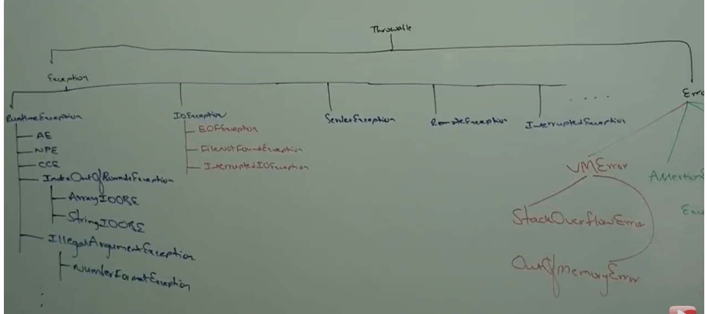
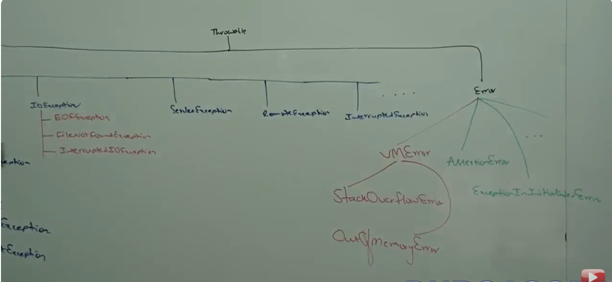

# Introduction:
- An unexpected or unwanted event that disturbs normal flow of the program is called exception.
- It is highly recommanded to handle exceptions and the main objective of exception handling is graceful termination of the program.
- Exception handling does not mean repairing an exception. We have to provide alternative way to continue rest of the program normally, is a concept of exception handling.
e.g.
try 
{
    // Read data from remote file located at london
} 
catch (FileNotFoundException e)
{
    // use local file & continue rest of the program normally
}

# Runtime stack mechanism:
- For every thread, JVM will create a runtime stack.
- Each and every method call performed by that thread will be stored in the corresponding stack.
- Each entry in the stack is called stack frame or activation record.
- After completing every method call the corresponding entry from the stack will be removed.
- After completing all method calls, the stack will become empty and that empty stack will be destroyed by JVM just before terminating the thread.
e.g.
class Test
{
    public static void main(String[] args) 
    {
        doStuff();
    }
    public static void doStuff() 
    {
        doMoreStuff();
    }
    public static void doMoreStuff() 
    {
        System.out.println("Hello");
    }
}

# Default exception handling:
- Inside a method, if any exception occurs the method in which it is rised is responsible to create exception object by including the following information:
1. name of exception.
2. description of exception.
3. location at which exception occurs (stack trace)

- After creating exception object, method hand overs that object to the JVM.
- JVM will check whether the method contains any exception handling code or not. If the method doesn't contain exception handling code then JVM terminates that method abnormally and removes the corresponding entry from the stack.
- Then JVM identifies caller method and checks whether caller methods contains any handling code or not.
- If the caller method doesn't contain handling code then JVM terminates that caller method also abnormally and removes the corresponding entry from the stack. This process will be continued until main method and if the main method also doesn't contain handling code then JVM terminates main method also abnormally and removes corresponding entry from the stack.
- Then JVM hand overs responsibility of exception handling to default exception handler, which is the part of JVM.
- Default exception handler prints exception information in the following format and terminates program abnormally:
Exception in thread "main" Name of Exception: Description
stack trace

e.g.
class Test
{
    public static void main(String[] args) 
    {
        doStuff();
    }
    public static void doStuff() 
    {
        doMoreStuff();
    }
    public static void doMoreStuff() 
    {
        System.out.println(10/0);
    }
}
Exception in thread "main" java.lang.ArithmeticException: / by zero
        at Test.doMoreStuff(main.java:260)
        at Test.doStuff(main.java:256)
        at Test.main(main.java:252)

e.g.
class Test
{
    public static void main(String[] args) 
    {
        doStuff();
        System.out.println(10/0);
    }
    public static void doStuff() 
    {
        doMoreStuff();
        System.out.println("Hi");
    }
    public static void doMoreStuff() 
    {
        System.out.println("Hello");
    }
}        
Hello
Hi
Exception in thread "main" java.lang.ArithmeticException: / by zero
        at Test.main(main.java:269)

# Note: In a program, if at least one method terminates abnormally then the program termination is abnormal termination. If all methods terminated normally then only program termination is normal termination.

# Exception Hirarchy:
- Throwable class acts as root for java exception hirarchy.
- Throwable class defines two child classes Exception and Error.

1. Exception:
- Most of the times exceptions are caused by our program and these are recoverable. e.g. If our program requirement is to read data from remote file locating at london, at runtime if remote file is not avaible then we will get runtime exception saying FileNotFoundException.
- If FileNotFoundException occurs, we can provide local file and continue rest of the program normally.

2. Error:
- Most of the times, errors are not caused by our program and these are due to lack of system resources.
- Errors are non-recoverable.
for example if OutOfMemomyError occurs, being a program we cannot do anything and the program will be terminated abnormally.

 
# Checked vs Unchecked Exceptions: (V.imp)
- The exceptions which are checked by compiler for smooth execution of the program are called checked exception.
e.g. FileNotFoundException
- In our program if there is a chance of raising checked exception then we must handle that checked exception (either by try-catch or throws keyword) otherwise we will get compile time error.

- The exceptions whcih are not checked by compiler whether programmer handling or not such type of exceptions are called unchecked exception.
e.g.
ArithmeticException

# Note: Whether it is checked or unchecked, every exception occurs at runtime only. There is no chance of occuring exceptions at compile time.

# Note: RuntimeException and its child classes, Error and its child classes are unchecked. Except these remaining are checked.

# Fully checked vs Partially checked:
- A checked exception is said to be fully checked if and only if all its child classes also checked.
e.g.
IOException, InterruptedException

- A checked exception is said to be partially checked if and only if some of its child classes are unchecked.
e.g.
Exception, Throwable

# Note: The only possible partially checked exxceptions in java are Exception and Throwable.

# Customized Exception Handling by try-catch:
- It is highly recommanded to handle exceptions.
- The code which may raise exception is risky code and we have to define that code inside try block and corresponding handling code we have to define inside catch block.

try
{
    risky code
}
catch (Exception e)
{
    Handling code
}

e.g.

class Test
{
    public static void main(String[] args)
    {
        System.out.println("Hey");
        try
        {
            System.out.println(10/0);
        }
        catch (ArithmeticException e)
        {
            System.out.println(10/5);
        }
        System.out.println("Hello");
    }
}
o/p:
Hey
5
Hello

# Control flow in try-catch:
try
{
    statement 1;
    statement 2;
    statement 3;
}
catch (Exception e)
{
    statement 4;
}
    statement 5;

case 1:
- If there is no exception:
O/p: statement 1 statement 2 statement 3 statement 5 - Normal termination

case 2:
- If an exception raised at statement 2 and corresponding catch block matched:
O/p: statement 1 statement 4 statement 5 - Normal termination

case 3:
- If an exception raised at statement 2 and corresponding catch block not matched:
O/p: statement 1 - Abnormal termination

case 4:
- If an exception raised at statement 4 or statement 5 then it is always abnormal termination.

# Note: Within the try block, if anywhere exception raised then rest of the try block won't be executed even though we handled that exception hence within the try block we have to take only risky code and length of try block should as less as possible.

# Note: In addition to try block, there may be a chance of raising an exception inside catch and finally blocks.

# Note: If any statement which is not part of try block and raises an exception then it is always abnormal termination.

# Methods to print Exception information:
- Throwable class defines the following methods to print exception information:

method                        printable format
-------------------------------------------------------------------------
1. printStackTrace()          Name of Exception: Description Stack Trace
2. toString()                 Name of Exception: Description
3. getMessage()               Description

e.g.
class Test
{
    public static void main(String[] args)
    {
        try
        {
            System.out.println(10/0);
        }
        catch (ArithmeticException e)
        {
            e.printStackTrace();  // java.lang.AE: / by zero at Test main()
            System.out.println(e); // or  System.out.println(e.toString());    // java.lang.AE: / by zero
            System.out.println(e.getMessage());    //   / by zero
        }
    }
}

- Internally default exception handler will use printStackTrace() method to print exception information to the console.

# try with multiple catch blocks:
- The way of handling exception is varied from exception to exception hence for every exception type it is highly recommanded to take separate catch block i.e. try with multiple catch blocks is always possible and recommanded to use.

try
{
    Risky code
} 
catch (ArithmeticException e)
{
    perform alternative arithmetic operations
}
catch (SQLException e)
{
    use mySQL db instead of oracle db
}
catch (FileNotFoundException e)
{
    use local file instead of remote file
}
catch (Exception e)
{
    default exception handling
}

- If try with multiple catch blocks present then the order of catch block is very important. We have to take child first and then parents otherwise we will get compile time error saying Exception XXX has already been caught.

e.g.
try
{
    Risky code
} 
catch (Exception e)
{
    default exception handling
} 
catch (ArithmeticException e)
{
    perform alternative arithmetic operations
} // CE: Exception java.lang.AE has already been caught

e.g.
try
{
    Risky code
} 
catch (ArithmeticException e)
{
    perform alternative arithmetic operations
}
catch (Exception e)
{
    default exception handling
} // valid

- We cannot declare two catch blocks for the same exception otherwise we will get compile time error.

# final vs finally vs finalize() : (v.imp)
# final :
- final is a modifier applicable for classes, methods and variables.
- If a class declared as final then we can't extend that class. we can't create child class for final class. Inheritance is not possible for final classes.
- If a method is final then we can't override that method in the child class.
- If a variable declared as final then we can't perform reassignment for that variable.

# finally :
- Finally is a block always associated with try-catch to maintain cleanup code.

try
{
    Risky code
}
catch (Exception e)
{
    Handling code
}
finally
{
    Cleanup code
}

- The speciality of finally block is it will be executed always irrespective of whether exception is raised or not or handled or not.

# finalize() :
- finalize() is a method always invoked by garbage collector just before destroying an object to perform cleanup activities.
- Once finalize() method completes immediately garbage collector destroy that object.

# Note: finally block is responsible to perform cleanup activities related to try block. Whatever resources we opened as a part of try block will be closed inside finally block whereas finalize method is responsible to cleanup activities related to object. Whatever resources associted with object will be deallocated before destroying an object by using finalize() method.

# various possible combination of try-catch-finally :
- In try-catch-finally, order is important.
- try without catch or finally is invalid.
- catch without try is invalid.
- finally without try is invalid.
- for try-catch-finally blocks curly braces are mandatory.

# throw keyword:
- Sometimes we can create exception object explicitly and we can hand over to the jvm manually, for this we have to use throw keyword.
e.g.
class Test
{
    public static void main(String[] args)
    {
        throw new ArithmeticException("/ by zero");
    }
}
- Hence, the main objective of throw keyword is to hand over our created exception object to the JVM manually.
- In this case programmer creating exception object explicitly and hand over to the jvm manually.

e.g.
class Test
{
    public static void main(String[] args)
    {
        System.out.println(10/0);
    }
}

- In this case main() method is responsible to create exception object and hand over to the jvm.

# Note: Best use of throw keyword is for user defined exception or customized exceptions.

case-1:
- throw e: If e refers null then we will get NullPointerException.
class Test
{
    static ArithmeticException e = new ArithmeticException();

    public static void main(String[] args)
    {
        throw e;
    }
} // RE: AE

class Test
{
    static ArithmeticException e;

    public static void main(String[] args)
    {
        throw e;
    }
} // RE: NPE

case-2:
- After throw statement, we are not allow any statement to write directly otherwise we will get compile time error saying CE: Unreacheable Statement.
class Test
{
    public static void main(String[] args)
    {
        System.out.println(10/0);
        System.out.println("Hello");
    }
} // RE

class Test
{
    public static void main(String[] args)
    {
        throw new ArithmeticException("/ by zero");
        System.out.println("Hello");
    }
} // CE: Unreacheable Statement

case-3:
- We can use throw keyword only for throwable types. If we are trying to use for normal java objects then we will get compile time error saying incompatible types.

class Test
{
    public static void main(String[] args)
    {
        throw new Test();
    }
} // CE: incompatible types

class Test extends RuntimeException
{
    public static void main(String[] args)
    {
        throw new Test();
    }
} // RE: Exception in thread "main" Test at Test.main()

# throws keyword : (v.imp)
- In our program, If there is a possibilty of rising checked exception, then we must handle that checked exception otherwise we will get compile time error.

e.g.
import java.io.*;
class Test
{
    public static void main(String[] args)
    {
        PrintWriter pw = new PrintWriter("abc.txt");
        pw.println("hello");
    }
} // CE: unreported exception

- We can handle this compile time error by using the 2 ways:
1. by using try-catch
2. by using throws keyword:
- We can use throws keyword to delegate responsibility of exception handling to caller (it may be another method or JVM) then caller method is responsible to handle that exception.
e.g.
class Test
{
    public static void main(String[] args) throws InterruptedException
    {
        Thread.sleep(10000);
    }
}

- Throws keyword required only for checked exception and usage of throws keyword for unchecked exception there is no use or impact.
- Throws keyword is required only to convience compiler.
- usage throws keyword does not prevent abnormal termination of the program.

e.g.
class Test
{
    public static void main(String[] args) throws InterruptedException
    {
        doStuff();
    }
    public static void doStuff() throws InterruptedException
    {
        doMoreStuff();
    }
    public static void doMoreStuff() throws InterruptedException
    {
        Thread.sleep(10000);
    }
} 

- In the above program, if we remove at least one throws statement then code won't compile.

# Note: It is recommanded to use try-catch over throws keyword.

case-1:
- we can use throws keyword for methods and constructors but not for classes.
- We can use throws keyword only for throwable types not for normal java classes.

e.g.
class Test extends RuntimeException
{
    public static void m1() throws Test
    {

    }
}

case-2:
class Test
{
    public static void main(String[] args)
    {
        throw new Exception();
    }
} // CE: unreported exception

class Test
{
    public static void main(String[] args)
    {
        throw new Error();
    }
} // RE: exception in thread "main"

case-3:
- Within the try block if there is no chance of rising exception then we can't write catch block for that exception. Otherwise we will get compile time error.
- But this rule is applicable only for fully checked exception.